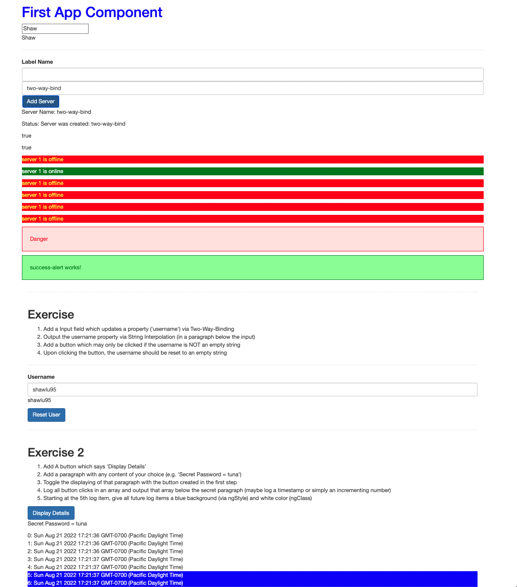

# AngularFirstApp

## Getting Started

- Download [Node](https://nodejs.org/en/) 16 or 18
- Download [WebStorm](https://www.jetbrains.com/webstorm/) IDE

```bash
# globally install cli
sudo npm install -g @angular/cli@latest

# init a project and select N when prompted
cd Documents/proj
ng new angular-first-app --no-strict

# serve website (nodemon)
cd new angular-first-app
ng serve
```

Use bootstrap css.

1. install bootstrap using npm
2. update [angular.json](./angular.json)

```bash
npm install --save bootstrap@3
```

Create new component with 4 files in a new folder named after component. Selector support:

1. select by component name
2. by attribute
3. by class name

```
ng generate component servers
ng g c servers
```

This project was generated with [Angular CLI](https://github.com/angular/angular-cli) version 14.1.3.

Demonstrate Angular directives:

- ngIf: conditional render component
- ngStyle: conditionally apply style
- ngClass: map class name to condition
- ngFor: render variable number of components

## 

## Development server

Run `ng serve` for a dev server. Navigate to `http://localhost:4200/`. The application will automatically reload if you change any of the source files.

## Code scaffolding

Run `ng generate component component-name` to generate a new component. You can also use `ng generate directive|pipe|service|class|guard|interface|enum|module`.

## Build

Run `ng build` to build the project. The build artifacts will be stored in the `dist/` directory.

## Running unit tests

Run `ng test` to execute the unit tests via [Karma](https://karma-runner.github.io).
